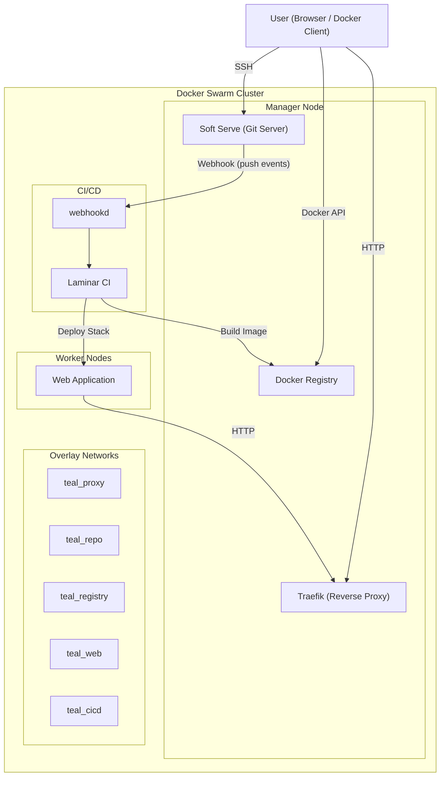
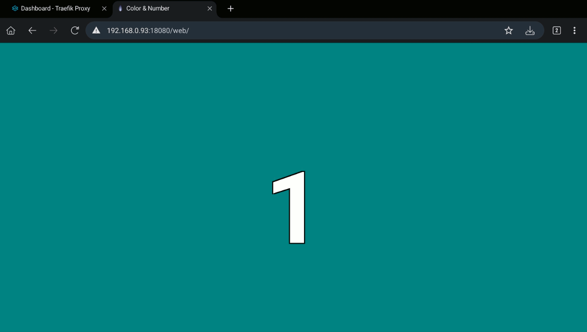
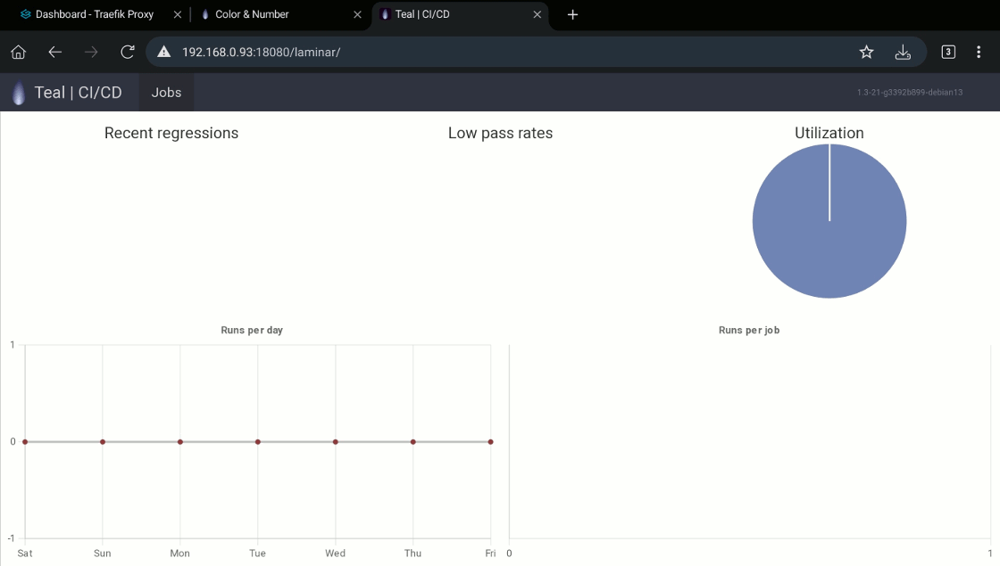
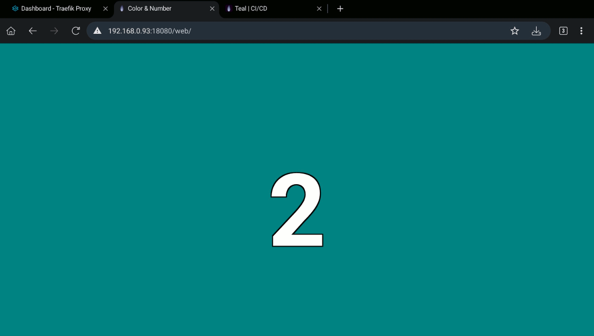

# Teal: Swarm Cluster Demo

> [Teal Color](https://colorffy.com/color-scheme-generator?color=008080)

## Introduction

This tutorial walks through building a complete, self-contained Docker Swarm environment for local development and experimentation. Using a cluster created with the `dsd` script, you will deploy and connect several real-world components:

* a reverse proxy (Traefik)
* a self-hosted Git server (Soft Serve)
* a private container registry
* a sample web application
* a simple CI/CD pipeline (Laminar + webhookd)

The cluster used in this tutorial consists of **1 manager node and 3 worker nodes**, all running locally using Docker-in-Docker. Although everything runs on a single host, this setup simulates a small distributed environment and allows you to explore how services are scheduled and communicate across nodes.

The goal is to provide a practical, end-to-end example of how services interact inside a Docker Swarm cluster. By the end of this tutorial, you will have a working system where:

* code is stored in a Git server
* changes trigger a CI/CD pipeline via webhooks
* new container images are built and stored in a registry
* applications are deployed and exposed through a reverse proxy

This setup is intentionally simplified and designed for learning purposes.

Before starting, make sure:

* Docker is installed and running
* you have already completed the main `dsd` README tutorial
* you are running commands from the directory containing this README

Keep in mind that you will need to replace the placeholder `CHANGE_WITH_YOUR_HOST` with the IP address (or hostname) where the swarm cluster is running (for example, `localhost` if you are running everything locally).

---

## Architecture

The following diagram shows how the main components in this demo are connected.



---

## Swarm Cluster

Start by creating a Docker Swarm cluster with the following command.

```bash
../dsd.sh up -p 12375:2375 -p 18080:80 -p 10022:23231 -e '--insecure-registry localhost:5000' 1 3
```

The main difference compared to the cluster in the main README is that here we expose an additional port to access the local Git server (hosted inside the swarm cluster), and we pass a parameter to allow an insecure local registry that we will also host.

---

## Application Proxy

In this section we will run [traefik](https://github.com/traefik/traefik) as our reverse proxy.

### Network

Create the network where the proxy will run.

```bash
docker network create \
    --driver overlay \
    --attachable \
    teal_proxy
```

Note: If the network already exists, Docker will return an error. You can safely ignore it if you are re-running the tutorial.

### Deploy

Deploy the proxy.

```bash
docker stack deploy \
    --detach=false \
    --compose-file swarm/proxy.yaml \
    teal_proxy
```

### Dashboard

Once the deployment finishes, you can access Traefik's dashboard at [http://CHANGE_WITH_YOUR_HOST:18080/traefik](http://CHANGE_WITH_YOUR_HOST:18080/traefik).


If the dashboard does not load, wait a few seconds and refresh the page. Services may take a short time to become available.

---

## Code Repository

In this section we will set up and run [soft serve](https://github.com/charmbracelet/soft-serve) as a self-hosted Git server, which we will use to store our project code.

Before starting, create SSH keys for the admin user. These keys will allow you to manage the server.

```bash
ssh-keygen -t ed25519 -C "admin@soft" -f ~/.ssh/for_soft_admin
```

Save the public key as a Swarm secret.

```bash
cat ~/.ssh/for_soft_admin.pub | sed 's/\s\+admin@soft$//' | docker secret create teal_soft_admin_keys -
```

### Network

Create the repository network.

```bash
docker network create \
    --driver overlay \
    --attachable \
    teal_repo
```

### Deploy

Deploy the service.

```bash
docker stack deploy \
    --detach=false \
    --compose-file swarm/repo.yaml \
    teal_repo
```

### Setup Admin

Check that you can access the server by running the following command.

```bash
ssh CHANGE_WITH_YOUR_HOST \
    -i ~/.ssh/for_soft_admin \
    -o IdentitiesOnly=yes \
    -o StrictHostKeyChecking=no \
    -o UserKnownHostsFile=/dev/null \
    -p 10022 -q \
    info
```

The output should be similar to:

```
Username: admin
Admin: true
Public keys:
  ssh-ed25519 AAAAC3...
```

If the connection fails, verify that the port is correctly exposed and that the container is running.

To simplify usage of **soft serve**, add the following configuration to your `~/.ssh/config` file. For more details, see the [official documentation](https://github.com/charmbracelet/soft-serve?tab=readme-ov-file#server-access).

```bash
Host soft-admin
  Hostname CHANGE_WITH_YOUR_HOST
  Port 10022
  IdentityFile ~/.ssh/for_soft_admin
  IdentitiesOnly yes
  StrictHostKeyChecking no
  UserKnownHostsFile /dev/null
  LogLevel QUIET
```

### Setup Authentication

Update the [authentication](https://github.com/charmbracelet/soft-serve?tab=readme-ov-file#authentication) settings.

Disable keyless connections:

```bash
ssh soft-admin settings allow-keyless false
```

Disable anonymous access:

```bash
ssh soft-admin settings anon-access no-access
```

### Setup User (member)

Create SSH keys for the main user (`member`).

```bash
ssh-keygen -t ed25519 -C "member@soft" -f ~/.ssh/for_soft_member
```

Create the user in the Git server.

```bash
ssh soft-admin user create member
```

Add the user's public key.

```bash
ssh soft-admin user add-pubkey member "$(cat ~/.ssh/for_soft_member.pub | sed 's/\s\+member@soft$//')"
```

Add the following configuration to `~/.ssh/config`.

```bash
Host soft
  Hostname CHANGE_WITH_YOUR_HOST
  Port 10022
  IdentityFile ~/.ssh/for_soft_member
  IdentitiesOnly yes
  StrictHostKeyChecking no
  UserKnownHostsFile /dev/null
  LogLevel QUIET
```

Verify access:

```bash
ssh soft info
```

Expected output:

```
Username: member
Admin: false
Public keys:
  ssh-ed25519 AAAAC3...
```

---

## Container Registry

For the container registry we will use Docker's [distribution](https://github.com/distribution/distribution) project.

### Network

Create the registry network.

```bash
docker network create \
    --driver overlay \
    --attachable \
    teal_registry
```

### Deploy

Run the following command. This will start the registry on the main manager and a proxy on all nodes, allowing image push and pull from any node.

```bash
docker stack deploy \
    --detach=false \
    --compose-file swarm/registry.yaml \
    teal_registry
```

### Test

Pull the alpine image.

```bash
docker pull alpine
```

Tag the image.

```bash
docker image tag alpine localhost:5000/teal/test
```

Push the image.

```bash
docker push localhost:5000/teal/test
```

Pull it again to confirm it works.

```bash
docker pull localhost:5000/teal/test
```

If push or pull fails, ensure the insecure registry flag was correctly set when creating the cluster.

### Remove Image from Registry

We will use the following calls to inspect and delete images from the registry.

```
curl -X GET http://<registry_host>:<port>/v2/<repo_name>/manifests/<tag>
curl -X DELETE http://<registry_host>:<port>/v2/<repo_name>/manifests/<digest>
```

Run a temporary container to perform the cleanup.

```bash
docker run --rm -it --network teal_registry alpine sh
```

Install `curl`.

```bash
apk update && apk add curl
```

Set the environment variables.

```bash
export REGISTRY_HOST='registry.teal'
export REGISTRY_PORT='5000'
export REPO_NAME='teal/test'
export REPO_TAG='latest'
export MANIFEST_URI="http://${REGISTRY_HOST}:${REGISTRY_PORT}/v2/${REPO_NAME}/manifests"
```

Get the image digest.

```bash
REPO_DIGEST=$(curl -s -I -H "Accept: application/vnd.oci.image.manifest.v1+json" "${MANIFEST_URI}/${REPO_TAG}" 2>&1 | grep 'Docker-Content-Digest' | awk -F' ' '{print $2}' | tr -dc '[:alnum:]:') \
&& echo ">> Digests: '${REPO_DIGEST}'"
```

Delete the image.

```bash
curl -X DELETE "${MANIFEST_URI}/${REPO_DIGEST}"
```

Exit the container and run the garbage collector.

```bash
docker exec -it $(docker ps | grep teal_registry_distribution | cut -d' ' -f1) /bin/registry garbage-collect --delete-untagged /etc/distribution/config.yml
```

Remove the local image.

```bash
docker rmi localhost:5000/teal/test:latest
```

---

## Dummy Web Site

### Create Project

Create a remote repository in **soft serve**.

```bash
ssh soft repo create color_number
```

Create a local repository by copying the `web` directory.

```bash
cp -r web web.git
```

Initialize and commit.

```bash
cd web.git && \
git init && \
git add . && \
git commit -m 'first commit'
```

Set the remote and push.

```bash
git remote add origin soft:color_number.git && \
git push -f -u origin master && \
cd ..
```

At this point, the project is tracked with Git and uses the local server as its remote.

### Container Image

Build the container image.

```bash
docker build \
    --force-rm \
    --tag localhost:5000/teal/web \
    ./web.git/
```

Push the image.

```bash
docker push localhost:5000/teal/web
```

### Deploy

Deploy the service.

```bash
docker stack deploy \
    --detach=false \
    --compose-file swarm/web.yaml \
    teal_web
```

Once the deployment finishes, access the site at [http://CHANGE_WITH_YOUR_HOST:18080/web](http://CHANGE_WITH_YOUR_HOST:18080/web).



If the page does not load, verify that Traefik is running and that the service is listed in `docker service ls`.

---

## CI/CD

In this section we will build a simple **Continuous Integration / Continuous Delivery** system. Each time code is pushed to the repository, the Git server sends a [webhook](https://en.wikipedia.org/wiki/Webhook) to a CI/CD service. That service fetches the changes, builds a new image, and deploys it to the cluster.

We will use:

* [laminar](https://github.com/ohwgiles/laminar): lightweight CI
* [webhookd](https://github.com/ncarlier/webhookd): webhook handler

Laminar does not support webhooks directly, so **webhookd** acts as a bridge.

### Guest User

Create SSH keys for the guest user.

```bash
ssh-keygen -t ed25519 -N '' -C "guest@soft" -f ~/.ssh/for_soft_guest
```

Save the private key as a secret.

```bash
cat ~/.ssh/for_soft_guest | docker secret create teal_soft_guest_private_key -
```

Create the user.

```bash
ssh soft-admin user create guest
```

Add the public key.

```bash
ssh soft-admin user add-pubkey guest "$(cat ~/.ssh/for_soft_guest.pub | sed 's/\s\+guest@soft$//')"
```

### Network

Create the CI/CD network.

```bash
docker network create \
    --driver overlay \
    --attachable \
    teal_cicd
```

### Container Images

Build the laminar image.

```bash
docker build \
    --force-rm \
    --tag localhost:5000/teal/laminar \
    --build-arg DOCKER_VERSION="$(docker version --format '{{.Client.Version}}')" \
    --target laminar \
    ./cicd/
```

Push it.

```bash
docker push localhost:5000/teal/laminar
```

Build the webhook image.

```bash
docker build \
    --force-rm \
    --tag localhost:5000/teal/webhook \
    --build-arg DOCKER_VERSION="$(docker version --format '{{.Client.Version}}')" \
    --target webhook \
    ./cicd/
```

Push it.

```bash
docker push localhost:5000/teal/webhook
```

Clean unused images.

```bash
docker image prune --force
```

### Deploy

Deploy the stack.

```bash
docker stack deploy \
    --detach=false \
    --compose-file swarm/cicd.yaml \
    teal_cicd
```

Access laminar at [http://CHANGE_WITH_YOUR_HOST:18080/laminar](http://CHANGE_WITH_YOUR_HOST:18080/laminar).



### Setup Laminar

Copy the jobs into the container.

```bash
docker cp ./cicd/jobs/. $(docker ps | grep teal_cicd_laminar | cut -d' ' -f1):/var/lib/laminar/cfg/jobs/
```

Copy swarm configuration files.

```bash
docker cp ./swarm $(docker ps | grep teal_cicd_laminar | cut -d' ' -f1):/var/lib/laminar/cfg/
```

Run a test job.

```bash
docker exec -it $(docker ps | grep teal_cicd_laminar | cut -d' ' -f1) bash -c 'laminarc queue hello foo=bar'
```

Check the dashboard to verify execution.

### Setup Webhookd

Create the logs directory (it is not created automatically).

```bash
docker run --rm -it --volume teal_cicd_webhook-data:/opt alpine mkdir -p /opt/logs
```

Copy webhook scripts.

```bash
docker cp ./cicd/hooks/. $(docker ps | grep teal_cicd_webhook | cut -d' ' -f1):/var/lib/webhook/
```

Test the webhook.

```bash
docker run --rm -it --network teal_cicd alpine wget \
    -qO- \
    --header="Content-Type: application/json" \
    --post-data='{"name": "John", "age": 30}' \
    http://webhook.cicd.teal/hello
```

### Test Whole Flow

Configure the repository to send webhooks on push.

```bash
ssh soft repo webhook create color_number "http://webhook.cicd.teal/laminar" -c json -e push
```

Now update the `web` repository by modifying the `config.env` file (change the value of `NUMBER` to 2), commit, and push. Follow the pipeline execution until the running site updates and displays the new number.



---

## Cleanup

To remove all resources created in this tutorial.

```bash
../dsd.sh down -n
```
