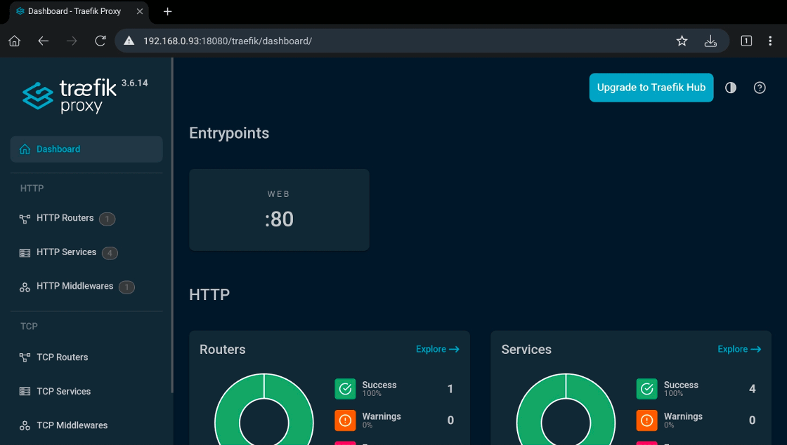

# Teal: Swarm Cluster Demo

> [Teal Color](https://colorffy.com/color-scheme-generator?color=008080)

## Introduction

This tutorial walks through building a complete, self-contained Docker Swarm environment for local development and experimentation. Using a cluster created with the `dsd` script, you will deploy and connect several real-world components.

The goal is to provide a practical, end-to-end example of how services interact inside a Docker Swarm cluster.

This setup is intentionally simplified and designed for learning purposes.

Before starting, make sure:

* Docker is installed and running
* you have already completed the main `dsd` README tutorial
* you are running commands from the directory containing this README

---

## Swarm Cluster

Start by creating a Docker Swarm cluster with the following command.

```bash
../dsd.sh up -p 12375:2375 -p 18080:80 -p 10022:23231 -e '--insecure-registry localhost:5000' 1 3
```

The main difference compared to the cluster in the main README is that here we expose an additional port to access the local Git server (hosted inside the swarm cluster), and we pass a parameter to allow an insecure local registry that we will also host.

---

## Application Proxy

In this section we will run [traefik](https://github.com/traefik/traefik) as our reverse proxy.

### Network

Create the network where the proxy will run.

```bash
docker network create \
    --driver overlay \
    --attachable \
    teal_proxy
```

Note: If the network already exists, Docker will return an error. You can safely ignore it if you are re-running the tutorial.

### Deploy

Deploy the proxy.

```bash
docker stack deploy \
    --detach=false \
    --compose-file swarm/proxy.yaml \
    teal_proxy
```

### Dashboard

Once the deployment finishes, you can access Traefik's dashboard at [http://CHANGE_WITH_YOUR_HOST:18080/traefik](http://CHANGE_WITH_YOUR_HOST:18080/traefik).



If the dashboard does not load, wait a few seconds and refresh the page. Services may take a short time to become available.

---

## Code Repository

In this section we will set up and run [soft serve](https://github.com/charmbracelet/soft-serve) as a self-hosted Git server, which we will use to store our project code.

Before starting, create SSH keys for the admin user. These keys will allow you to manage the server.

```bash
ssh-keygen -t ed25519 -C "admin@soft" -f ~/.ssh/for_soft_admin
```

Save the public key as a Swarm secret.

```bash
cat ~/.ssh/for_soft_admin.pub | sed 's/\s\+admin@soft$//' | docker secret create teal_soft_admin_keys -
```

### Network

Create the repository network.

```bash
docker network create \
    --driver overlay \
    --attachable \
    teal_repo
```

### Deploy

Deploy the service.

```bash
docker stack deploy \
    --detach=false \
    --compose-file swarm/repo.yaml \
    teal_repo
```

### Setup Admin

Check that you can access the server by running the following command.

```bash
ssh CHANGE_WITH_YOUR_HOST \
    -i ~/.ssh/for_soft_admin \
    -o IdentitiesOnly=yes \
    -o StrictHostKeyChecking=no \
    -o UserKnownHostsFile=/dev/null \
    -p 10022 -q \
    info
```

The output should be similar to:

```
Username: admin
Admin: true
Public keys:
  ssh-ed25519 AAAAC3...
```

If the connection fails, verify that the port is correctly exposed and that the container is running.

To simplify usage of **soft serve**, add the following configuration to your `~/.ssh/config` file. For more details, see the [official documentation](https://github.com/charmbracelet/soft-serve?tab=readme-ov-file#server-access).

```bash
Host soft-admin
  Hostname CHANGE_WITH_YOUR_HOST
  Port 10022
  IdentityFile ~/.ssh/for_soft_admin
  IdentitiesOnly yes
  StrictHostKeyChecking no
  UserKnownHostsFile /dev/null
  LogLevel QUIET
```

### Setup Authentication

Update the [authentication](https://github.com/charmbracelet/soft-serve?tab=readme-ov-file#authentication) settings.

Disable keyless connections:

```bash
ssh soft-admin settings allow-keyless false
```

Disable anonymous access:

```bash
ssh soft-admin settings anon-access no-access
```

### Setup User (member)

Create SSH keys for the main user (`member`).

```bash
ssh-keygen -t ed25519 -C "member@soft" -f ~/.ssh/for_soft_member
```

Create the user in the Git server.

```bash
ssh soft-admin user create member
```

Add the user's public key.

```bash
ssh soft-admin user add-pubkey member "$(cat ~/.ssh/for_soft_member.pub | sed 's/\s\+member@soft$//')"
```

Add the following configuration to `~/.ssh/config`.

```bash
Host soft
  Hostname CHANGE_WITH_YOUR_HOST
  Port 10022
  IdentityFile ~/.ssh/for_soft_member
  IdentitiesOnly yes
  StrictHostKeyChecking no
  UserKnownHostsFile /dev/null
  LogLevel QUIET
```

Verify access:

```bash
ssh soft info
```

Expected output:

```
Username: member
Admin: false
Public keys:
  ssh-ed25519 AAAAC3...
```
